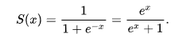
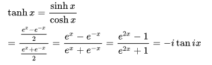
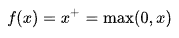

# 컴퓨터 비전과 신경망

## 신경망

인공신경망(ANN, artificial neural network) : 정보를 처리하는 일, 일반적인 패턴을 인식하거나 새로운 패턴을 탐지하는 일, 복잡한 절차를 근접시키는 일에 탁월한 머신러닝 도구.

### 활성화 함수

- 시그모이드 함수 :
- 쌍곡탄젠트 : 
- 정류 선형 유닛 : 


## 뉴런

```python
class Neuron(object):
    """
    A simple artificial neuron, processing an input vector and returning a corresponding activation.
    Args:
        num_inputs (int): The input vector size / number of input values.
        activation_function (callable): The activation function defining this neuron.
    Attributes:
        W (ndarray): The weight values for each input.
        b (float): The bias value, added to the weighted sum.
        activation_function (callable): The activation function computing the neuron's output.
    """

    def __init__(self, num_inputs, activation_function):
        super().__init__()

        # Randomly initializing the weight vector and the bias value (e.g., using a simplistic 
        # uniform distribution between -1 and 1):
        self.W = np.random.uniform(size=num_inputs, low=-1., high=1.)
        self.b = np.random.uniform(size=1, low=-1., high=1.)

        self.activation_function = activation_function

    def forward(self, x):
        """
        Forward the input signal through the neuron, returning its activation value.
        Args:
            x (ndarray): The input vector, of shape `(1, num_inputs)`
        Returns:
            activation (ndarray): The activation value, of shape `(1, layer_size)`.
        """
        z = np.dot(x, self.W) + self.b
        return self.activation_function(z)

```


## 뉴런 계층화하기

```python
class FullyConnectedLayer(object):
    """A simple fully-connected NN layer.
    Args:
        num_inputs (int): The input vector size / number of input values.
        layer_size (int): The output vector size / number of neurons in the layer.
        activation_function (callable): The activation function for this layer.
    Attributes:
        W (ndarray): The weight values for each input.
        b (ndarray): The bias value, added to the weighted sum.
        size (int): The layer size / number of neurons.
        activation_function (callable): The activation function computing the neuron's output.
        x (ndarray): The last provided input vector, stored for backpropagation.
        y (ndarray): The corresponding output, also stored for backpropagation.
        derivated_activation_function (callable): The corresponding derivated function for backpropagation.
        dL_dW (ndarray): The derivative of the loss, with respect to the weights W.
        dL_db (ndarray): The derivative of the loss, with respect to the bias b.
    """

    def __init__(self, num_inputs, layer_size, activation_function, derivated_activation_function=None):
        super().__init__()

        # Randomly initializing the weight vector and the bias value (using a normal distribution this time):
        self.W = np.random.standard_normal((num_inputs, layer_size))
        self.b = np.random.standard_normal(layer_size)
        self.size = layer_size

        self.activation_function = activation_function
        self.derivated_activation_function = derivated_activation_function
        self.x, self.y = None, None
        self.dL_dW, self.dL_db = None, None

    def forward(self, x):
        """
        Forward the input vector through the layer, returning its activation vector.
        Args:
            x (ndarray): The input vector, of shape `(batch_size, num_inputs)`
        Returns:
            activation (ndarray): The activation value, of shape `(batch_size, layer_size)`.
        """
        z = np.dot(x, self.W) + self.b
        self.y = self.activation_function(z)
        self.x = x  # (we store the input and output values for back-propagation)
        return self.y

    def backward(self, dL_dy):
        """
        Back-propagate the loss, computing all the derivatives, storing those w.r.t. the layer parameters,
        and returning the loss w.r.t. its inputs for further propagation.
        Args:
            dL_dy (ndarray): The loss derivative w.r.t. the layer's output (dL/dy = l'_{k+1}).
        Returns:
            dL_dx (ndarray): The loss derivative w.r.t. the layer's input (dL/dx).
        """
        dy_dz = self.derivated_activation_function(self.y)  # = f'
        dL_dz = (dL_dy * dy_dz) # dL/dz = dL/dy * dy/dz = l'_{k+1} * f'
        dz_dw = self.x.T
        dz_dx = self.W.T
        dz_db = np.ones(dL_dy.shape[0]) # dz/db = d(W.x + b)/db = 0 + db/db = "ones"-vector

        # Computing the derivatives with respect to the layer's parameters, and storing them for opt. optimization:
        self.dL_dW = np.dot(dz_dw, dL_dz)
        self.dL_db = np.dot(dz_db, dL_dz)

        # Computing the derivative with respect to the input, to be passed to the previous layers (their `dL_dy`):
        dL_dx = np.dot(dL_dz, dz_dx)
        return dL_dx

    def optimize(self, epsilon):
        """
        Optimize the layer's parameters, using the stored derivative values.
        Args:
            epsilon (float): The learning rate.
        """
        self.W -= epsilon * self.dL_dW
        self.b -= epsilon * self.dL_db
```


## 신경망 훈련시키기

### 1. 지도학습

신경망에 두 양식을 매핑하여 가르치고 싶을 때 사용

이미지와 그 이미지의 실제 레이블을 모두 포함한 훈련 데이터셋으로 학습

### 2. 비지도 학습

실측 정보를 알 수 없을 때 사용

네트워크의 입력과 그에 대응하는 출력에만 기반해 네트워크의 손실을 계산하는 함수를 만듬

### 3. 강화 학습

상호작용에 기반한 전략

미리 정의된 리스트의 행동을 가지고 있으며 각 행동이 끝났을 때 새로운 상태가 된다. 이 상태에서 일부는 긍정적 보상을 주고 일부는 부정적 보상을 주어 어떻게 해야 더 높은 보상을 받을 수 있는지 학습한다. 최종적으로 보상을 최대화할 수 있는 일련의 행위를 추정하여 학습하게 된다. 

