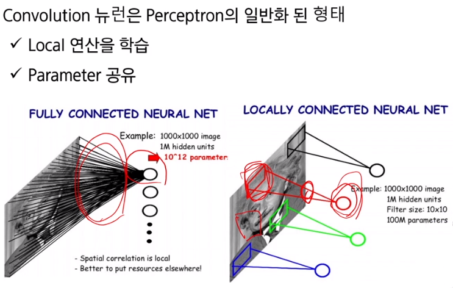
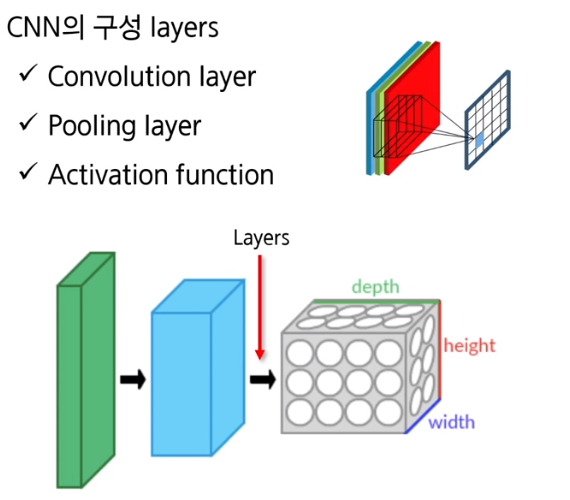
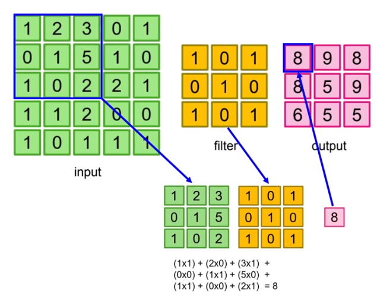
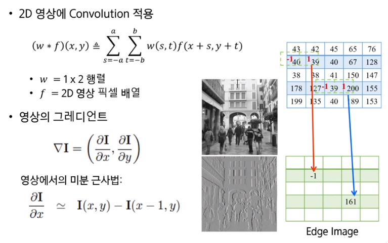
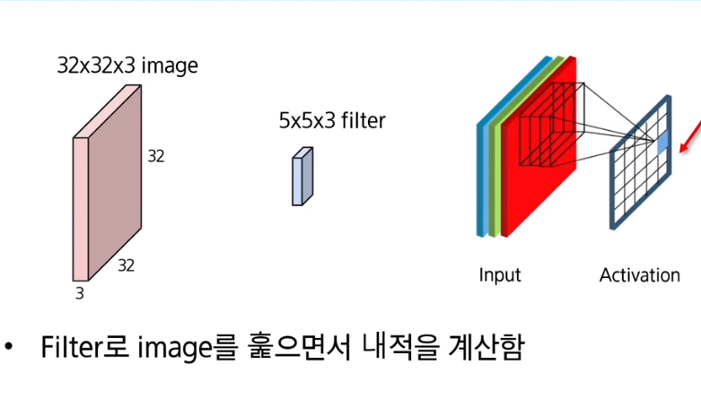
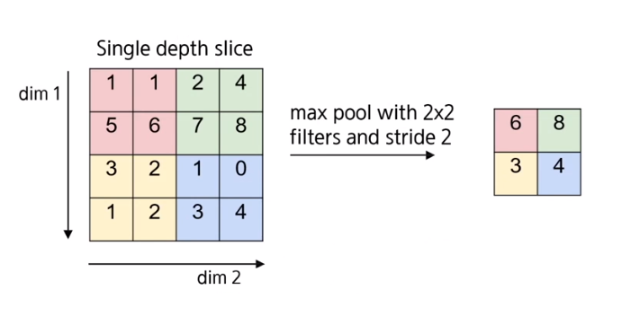

# CNN 

> Convolutional Neural Network

## Convolution layer

모든 입력을 다음 층(layer)과 연결하지 않고, 국부적인 영역에 대한 filter 연산만으로 locally connectied 된 부분에 대해서만 출력을 계산하는 layer. 하나의 filter가 영상의 위치에 상관없이 재활용되는 합성곱(convolution) 연산을 활용

CNN은 공간적인 주고 정보를 보존하면서 연산 및 학습이 가능하기 때문에 영상 데이터를 처리하기 위한 네트워크 구조로 매우 적합. 영상에서는 비슷한 패턴이 다른 위치에서 발생할 수 있기 때문에 동일한 filter를 공유해서 사용함으로써 입력을 처리하는데 필요한 파라미터 수를 획기적으로 줄일 수 있다. 이는 학습에 필요한 시간을 단축 시킴과 동시에 오버피팅이라는 안 좋은 효과를 방지하는데 탁월한 효과를 보임.

## Pooling layer

- Max pooling : 영역 내에 최대값을 추출

- Mean pooling : 영역 내에 평균값을 계산하여 추출
