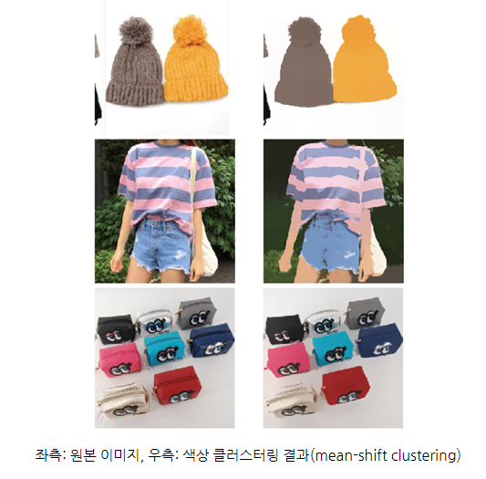
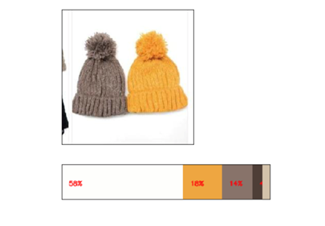
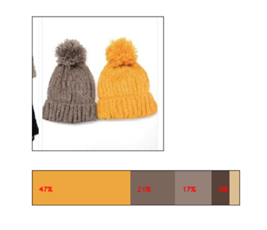

# 딥러닝을 이용해 상품 이미지에서 색상 속성 추출하기

## 색상 clustering

이미지의 색상은 같은 색이어도 조명이나 그림자 등의 영향으로 인해 색상값을 추출해보면 다양한 색상의 픽셀 값을 갖게 된다. 이를 해결하기 위해 세그먼테이션 기법을 활용하여 다양한 색상 값을 몇 가지의 색상 값으로 클러스터링을 한다. 

## Foreground Extraction 기법

색상 클러스터링을 통해 색상을 뽑아낸다고 해도 색상 비율을 추출하게 되면 대부분 배경색의 비중이 가장 많이 나오는 결과가 나온다. 

전체 이미지 영역 중에서 관심 상품에 해당하는 주요 오브젝트를 추출하고, 해당 오브젝트 영역에 대한 색상 값만을 추출해야 한다. 

이를 해결하기 위해 이미지에서 전경과 배경 분리에 많이 사용되는 GrabCut 알고리즘을 사용한다. 

이 알고리즘을 활용하여 Foreground Extractiond을 수행하면 배경색을 제외한 상품의 영역에서만 색상을 추출할 수 있다. 

[출처](https://m.blog.naver.com/PostView.naver?isHttpsRedirect=true&blogId=tmondev&logNo=221482642227)
